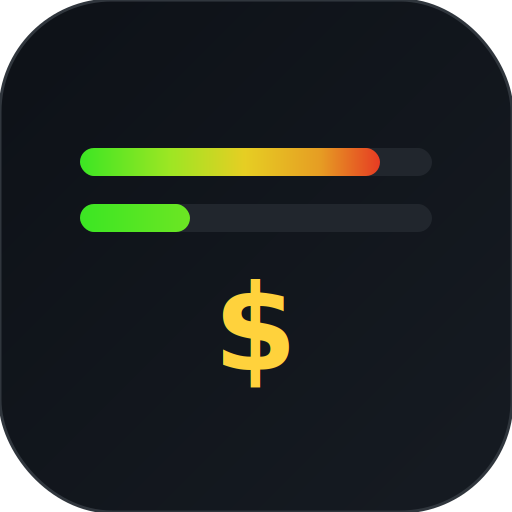
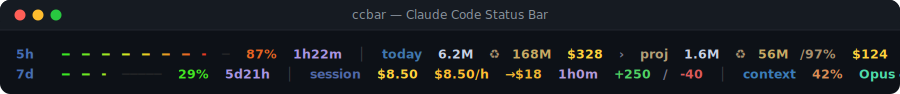

<div align="center">

<br>



# ccbar

**Vibe coding 不再是闹着玩的。你得知道它花了多少。**

单文件 · 零依赖 · 纯 Python 标准库

[](https://pypi.org/project/ccbar/)
[](https://pypi.org/project/ccbar/)
[](LICENSE)


[](README.md)
[](#)

<br>



</div>

<br>

## 安装

```bash
pip install ccbar
ccbar --install
```

重启 Claude Code，底部出现两行。搞定。

## 你看到什么

| 行 | 内容 |
|----|------|
| **1** | `5h` 配额条 + 倒计时 · `today` token + ♻缓存 + 费用 › 项目细分 · `week` 总计 · `month` 总计 |
| **2** | `7d` 配额条 + 倒计时 · `session` 费用 + 燃烧率 + 预测 + 时长 + 代码行 · `context`% + 模型 + 时钟 · `total` 项目总成本 + 路径 |

终端太窄？尾部列自动裁掉，列内内容永不修改。

## 为什么数字是准的

- **按模型定价** — Opus 输出 $75/百万，Haiku 只要 $4/百万。ccbar 逐条读取模型 ID，不搞统一费率。
- **流式去重** — 每次 API 调用写入 2–7 条 JSONL。ccbar 按 `message.id` 去重，每条消息只算一次。
- **缓存区分** — 缓存读取只有新输入 10% 的价格。ccbar 分别追踪，按项目显示 ♻命中率。
- **跨会话累计** — 会话费用重启归零，你的账单没有。ccbar 扫描全部 JSONL——日、周、月、按项目。

## 还有什么

- **燃烧率** — `$8.50/h` 告诉你这个会话的烧钱速度。`→$18` 预测到配额重置时的总费用。
- **配额条** — 绿→黄→红 HSL 渐变。5 小时和 7 天配额一眼看清。
- **项目细分** — `› proj ♻56M/97% $124` — 哪个项目在吃你的预算。
- **自适应布局** — 默认 2 行 × 4 列。终端变窄时裁列，内容永不截断。

## 配置

```bash
export CCBAR_LAYOUT="5h,today,week,month|7d,session,model,total"
# 或
ccbar --init-config   # → ~/.config/ccbar.json
```

<details>
<summary>配置参考</summary>

```json
{
  "rows": [["5h", "today", "week", "month"], ["7d", "session", "model", "total"]],
  "columns": null,
  "colors": {},
  "pricing": {
    "claude-opus-4-6":    { "in": 15,  "out": 75, "cc": 18.75, "cr": 1.5  },
    "claude-sonnet-4-6":  { "in": 3,   "out": 15, "cc": 3.75,  "cr": 0.3  },
    "claude-haiku-4-5":   { "in": 0.8, "out": 4,  "cc": 1,     "cr": 0.08 }
  }
}
```

| 字段 | 说明 |
|------|------|
| `rows` | 布局网格——可用项: `5h` `7d` `today` `week` `month` `session` `model` `total` |
| `columns` | 覆盖终端宽度（`null` = 自动检测） |
| `pricing` | 每百万 token 价格 |
| `colors` | `[R, G, B]` 颜色覆盖 |

</details>

## 工作原理

```
stdin JSON → 检测终端宽度 → 获取 OAuth 配额（缓存 30s）
           → 扫描 ~/.claude/projects/**/*.jsonl（缓存 60s）
           → 按 message.id 去重 → 按模型定价 → 自适应布局 → stdout
```

OAuth — macOS 自动从 Keychain 读取。Linux/CI：`export CLAUDE_OAUTH_TOKEN="..."`。无 OAuth 时配额条显示 `--`。

## 卸载

```bash
ccbar --uninstall && pip uninstall ccbar
```

---

<div align="center">

MIT · 为把 AI 算力当预算科目的开发者而做。

</div>
